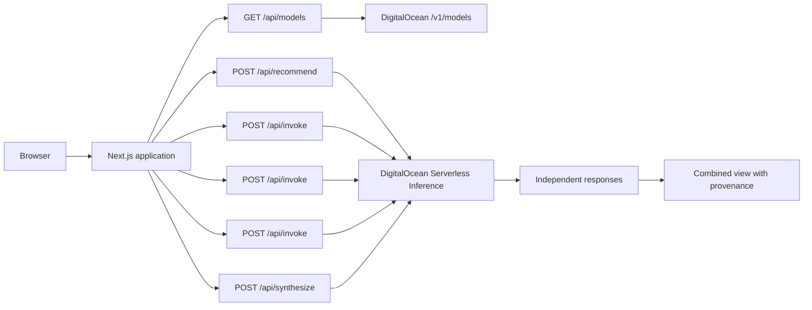

# Model Council

> Ask once. Decide with confidence.

Model Council is a take-home prototype for reducing “model FOMO.” It can recommend a balanced three-model council for each prompt, sends that prompt through DigitalOcean Serverless Inference, progressively shows each independent response, and produces a transparent combined view that preserves agreements, disagreements, and source-model provenance.


## Product thesis

Customers do not need another generic benchmark telling them which model is universally “best.” They need evidence for their prompt, their operating constraints, and their definition of quality.

Model Council therefore separates four jobs:

1. **Route:** Consider every model in the deployment's dated, compatibility-tested catalog and recommend three complementary choices using task type, complexity, cost, and latency—not complexity alone.
2. **Compare:** Show the original responses without hiding inconvenient differences.
3. **Understand:** Display objective latency, token, and estimated-cost measurements.
4. **Combine:** Synthesize useful common ground while linking every section back to the contributing models.

The product intentionally avoids invented quality scores. Users can make and record their own preference after reviewing the evidence.

For live combined answers, the app prefers DigitalOcean's opt-in **Model Synthesis** server-side tool. It falls back to a direct synthesizer model when the account has not enabled that public preview, while preserving the same validated provenance contract.

## Experience

- Submit up to 4,000 characters and search or filter the verified DigitalOcean model directory before selecting two or three models.
- Use **Auto-pick Beta** to consider the same live directory, preview three recommended models and a concrete reason for each selection, then edit the council before running it.
- Receive independent results progressively; one failure never removes successful responses.
- Compare latency, token usage, and estimated cost using a versioned pricing table.
- Review a combined answer with clickable source-model badges.
- Inspect areas of agreement and meaningful disagreement.
- Select an individual response or the combined answer.
- Run without credentials using a representative fixture mode.

## Architecture



Inference credentials are only read inside server routes. Prompts and decisions are intentionally not persisted in this prototype.

## Local setup

Requirements:

- Node.js 22.13 or newer
- npm
- A DigitalOcean inference key only when using live mode

```bash
npm install
cp .env.example .env.local
npm run dev
```

Open [http://localhost:3000](http://localhost:3000).

### Demo mode

The default configuration uses realistic fixtures and does not make billable model requests:

```env
DEMO_MODE=true
```

Fixture mode remains fully interactive and mirrors the latest verified text-model catalog. It deliberately simulates different model latency, answers, token usage, partial results, and synthesis.

### Live DigitalOcean inference

Create a model access key under DigitalOcean **Inference → Serverless Inference**, maintain a positive prepaid inference balance, and update `.env.local`:

```env
DEMO_MODE=false
DIGITALOCEAN_INFERENCE_KEY=your-server-side-key
DIGITALOCEAN_INFERENCE_BASE_URL=https://inference.do-ai.run/v1
AUTO_PICK_MODEL_ID=openai-gpt-oss-20b
SYNTHESIZER_MODEL_ID=openai-gpt-oss-20b
USE_NATIVE_MODEL_SYNTHESIS=false
```

Never prefix the inference key with `NEXT_PUBLIC_`, commit it, paste it into issue reports, or expose it in client-side code.

In live mode, the server loads currently available IDs from DigitalOcean's authenticated `/v1/models` endpoint, filters out image, audio, video, embedding, reranking, and router IDs, and intersects the result with a dated compatibility-tested allowlist. The browser therefore sees only models that both still exist and produced a non-empty response through this deployment on the latest probe. The same allowlist is the credential-free fallback. Model availability and pricing change over time; review `VERIFIED_MODEL_IDS` in `lib/models.ts` against the [DigitalOcean model catalog](https://docs.digitalocean.com/products/inference/details/models/).

### Re-check model compatibility

The latest full probe ran on **August 25, 2026** against 55 text-model candidates. Twenty produced valid responses through the deployed application. The report is in [`docs/model-compatibility-2026-08-25.md`](docs/model-compatibility-2026-08-25.md).

To smoke-test every model currently exposed by a running Model Council deployment:

```bash
MODEL_COUNCIL_URL=https://your-app.example npm run probe:models
```

This makes real, potentially billable inference calls. It uses four concurrent workers, a minimal response prompt, and a 40-second client timeout. A successful provider discovery response is not treated as proof that the account tier can invoke a model.

## API contracts

### `GET /api/models`

Returns the verified text-model directory for the current DigitalOcean access key, its compatibility-probe timestamp, and whether it came from live discovery, fixtures, or fallback configuration. The inference key never reaches the browser. Results are cached briefly to avoid adding a catalog lookup to every interaction.

### `POST /api/recommend`

Accepts a prompt and returns exactly three model IDs from the currently verified directory, with roles, selection reasons, task type, complexity, and routing priority. In live mode, a lightweight DigitalOcean-hosted model considers the complete verified directory. Invalid output, timeouts, a missing key, or selector failure degrade to the same response contract using transparent local rules, so Auto-pick never blocks manual comparison.

### `POST /api/invoke`

```json
{
  "prompt": "Explain the tradeoffs…",
  "modelId": "openai-gpt-oss-120b"
}
```

Returns the model output, measured latency, token usage, estimated cost when a configured rate is available, and `demo` or `live` mode. The route accepts only IDs in the server-discovered directory, supports both Chat Completions and Responses-only text models, validates prompt length, applies a 30-second timeout, and redacts upstream details from user-facing errors.

### `POST /api/synthesize`

Accepts the original prompt and two or three successful model results. It returns answer sections, agreements, disagreements, a recommendation, and validated source-model IDs. Candidate responses are treated as untrusted evidence rather than synthesis instructions. In live mode it first uses the [DigitalOcean Model Synthesis server-side tool](https://docs.digitalocean.com/products/inference/how-to/use-built-in-tools/), with a direct-model fallback for accounts that have not opted into the preview.

## Validation

```bash
npm run typecheck
npm run lint
npm test
npm run eval:gateway
```

The test suite verifies server rendering, the dated verified model directory, input validation, directory-constrained and explainable Auto-pick recommendations, the independent-result contract, objective metrics, and that synthesis provenance only references submitted responses.

The gateway evaluation suite adds 30 versioned technical, writing, analysis, explanation, general, and adversarial routing cases. It measures contract validity, verified-ID compliance, task and complexity accuracy, expected-capability Hit@3, provider diversity, and p50/p95 routing latency. The checked-in fixture scorecard is at [`evals/results/gateway-scorecard-fixture.md`](evals/results/gateway-scorecard-fixture.md); the complete methodology and opt-in live/blinded outcome commands are in [`docs/gateway-evaluations.md`](docs/gateway-evaluations.md).

Evaluation scores are internal decision evidence, not objective model-quality claims. Live routing and outcome evaluation require an explicit billable-run acknowledgement, and answer quality is reviewed as blinded A/B preference with its sample size and protocol disclosed.

## Deploy to DigitalOcean App Platform

1. Push the repository to GitHub.
2. Replace `YOUR_GITHUB_USER` in `.do/app.yaml` with the repository owner.
3. In DigitalOcean, choose **Create → App Platform** and import the repository or app specification.
4. Leave `DEMO_MODE=true` for a credential-free review deployment, or set it to `false` and add `DIGITALOCEAN_INFERENCE_KEY` as an encrypted runtime variable.
5. Opt into the Model Synthesis public preview under DigitalOcean Feature Preview for the native combined-answer path; otherwise the app automatically uses its direct-model fallback.
6. Set `NEXT_PUBLIC_SITE_URL` to the deployed HTTPS origin and redeploy so social metadata uses the production URL.
7. Run the example prompts and confirm raw results remain usable if a synthesis or individual model request fails.

App Platform sets `PORT`; the production server listens on that value automatically.

## Important tradeoffs

- **No persistence:** Keeps the assignment focused and prevents prompt retention. Saved comparisons belong in a later phase.
- **Partial price configuration:** The discovery endpoint exposes IDs but not token prices. Known rates remain explainable estimates; other models show “Rate unavailable” instead of a fabricated value.
- **Model-generated synthesis:** Useful but not ground truth. Originals and disagreements always remain visible.
- **Explainable routing:** Auto-pick is a recommendation, not an invisible quality score. The user sees and can change every model before inference begins.
- **No authentication or public rate limiting:** Appropriate for a controlled take-home demo, not an unrestricted production deployment.
- **Chat Completions compatibility:** Maximizes consistency across the selected open models; model-specific advanced features are intentionally deferred.
- **Dated health snapshot:** A passed probe proves that a model worked for this account and request shape at that time, not permanent uptime. Production would refresh the allowlist with a scheduled, authenticated health job and retain the last-known-good set on transient provider failures.

## Roadmap

- **Next:** Saved comparisons, blind model names, human voting, reusable prompt sets, and custom rubrics.
- **Then:** DigitalOcean Evaluations for customer datasets and quality-versus-cost analysis.
- **Later:** Convert winning experiments into DigitalOcean Inference Router policies with fallbacks and operating constraints. The current selector returns a visible three-model council; a production router would choose a single serving path after the user has learned what wins.
- **Long term:** Champion–challenger traffic, model/version drift alerts, automatic re-evaluation, and workload-specific Model Autopilot.

## Suggested review demo

1. Choose the architecture example and select **Auto-pick Beta**.
2. Explain the three recommended roles, then swap a model to show that the user stays in control.
3. Run the council and point out that responses complete independently.
4. Compare objective latency, token, and cost data.
5. Open the combined answer and use its source badges to jump back to the evidence.
6. Show an algorithm or failure-behavior disagreement instead of hiding it, then select the answer you trust.
