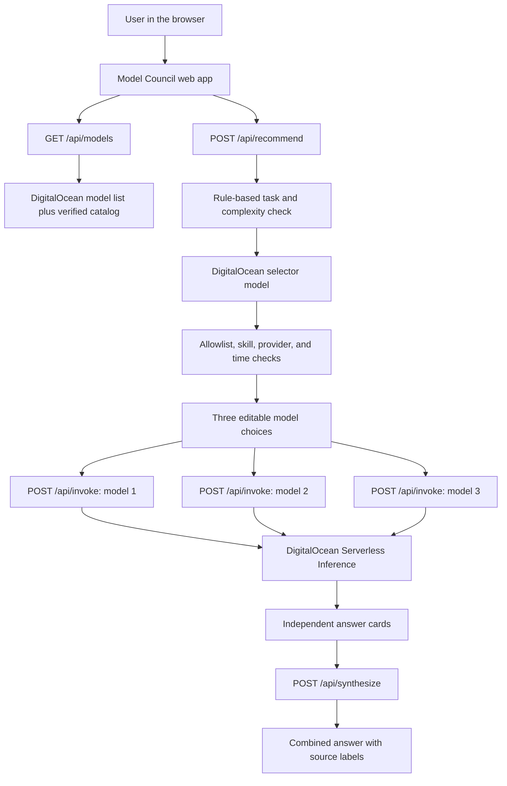

# Model Council

> Ask once. Decide with confidence.

Model Council helps people compare AI models for their own prompt. A user can send one prompt to two or three models, read each answer, compare speed, token use, and estimated cost, and then read one combined answer with clear source labels.

The main goal is simple:

> A user should not have to guess which model is best or trust one model without seeing other options.


## 1. Quick links

- **Live application:** [https://model-council-wp6iu.ondigitalocean.app](https://model-council-wp6iu.ondigitalocean.app)
- **GitHub repository:** [https://github.com/AnkitKhowal/model-council](https://github.com/AnkitKhowal/model-council)
- **Full product roadmap:** [Stack-ranked Model Council roadmap](ROADMAP.md)
- **Gateway test comparison:** [Before and after Auto-pick changes](evals/results/gateway-scorecard-comparison.md)
- **Model check report:** [DigitalOcean model compatibility report](docs/model-compatibility-2026-08-25.md)

### Project at a glance

| Item | Answer |
| --- | --- |
| Main problem | Users are not sure which AI model to choose for a prompt. |
| Main experience | Run one prompt through two or three models and compare the results. |
| Extra help | Auto-pick suggests a balanced three-model group that the user can edit. |
| Live model catalog | 20 DigitalOcean text models that passed the latest request check. |
| AI service | DigitalOcean Serverless Inference. |
| Hosting | DigitalOcean App Platform. |
| Safe demo mode | Built-in sample answers that do not make paid model calls. |
| Test coverage | 13 application tests and 30 saved gateway test prompts. |

## 2. The problem

DigitalOcean gives customers access to many AI models. This is useful, but it also creates a new problem: people may not know which model to choose. We call this “model FOMO,” which means worrying that another model might give a better answer.

Different models can be better at different jobs:

- One model may be better at code.
- One may explain ideas more clearly.
- One may be faster or cheaper.
- One may find a risk that another model missed.
- A model that works well for one prompt may not be the best choice for another prompt.

Public leaderboards do not fully solve this problem. They test fixed data and give a general result. A customer still needs to know what works for their own prompt.

Model Council gives the user direct evidence from the models instead of asking them to trust one general ranking.

## 3. What the application does

The user follows this flow:

1. Enter one prompt.
2. Choose two or three models, or use **Auto-pick Beta**.
3. Review the three models suggested by Auto-pick and change them if needed.
4. Start the comparison.
5. The application calls each model at the same time.
6. Each model card finishes on its own. One failed model does not remove the other answers.
7. The user compares the original answers, speed, token use, and estimated cost.
8. If at least two models succeed, the application creates a combined answer.
9. Every combined section shows which original models supported it.
10. The user can choose the answer they prefer.

The application does not stream answer tokens one by one. It starts a separate request for every selected model. Each card appears with its full answer as soon as that model finishes. This keeps the code simple while still letting faster models finish before slower models.

## 4. Why we added Auto-pick Beta

Manual model selection is useful for experienced users, but it does not fully solve model choice for a new user. A list of 20 model names can still feel like guesswork.

Auto-pick is an extra recommendation step before the model calls begin. It helps the user create a useful three-model group without hiding the choice from them.

### How Auto-pick works

1. The server checks the prompt with clear rules.
2. It labels the task, such as writing, technical work, analysis, or a simple explanation.
3. It labels the prompt as low, medium, or high complexity.
4. A small selector model hosted by DigitalOcean reviews the full verified model list.
5. It suggests exactly three models:
   - **Best fit:** the strongest first choice for the task.
   - **Complement:** a model that adds another point of view or provider.
   - **Challenger:** a faster, cheaper, or different option.
6. The server checks the suggestion before showing it.
7. The user sees all three models and the reason for each choice.
8. The user can replace any model before running the council.

The server only accepts an Auto-pick result when:

- all three model IDs are in the verified catalog;
- all three IDs are different;
- the task and complexity labels match the rule-based prompt check;
- the group covers the skills needed for the task;
- the group includes at least two providers; and
- the selector finishes inside a two-second internal time limit.

If any check fails, the application returns a safe rule-based group and tells the user that it used the fallback.

### Does Auto-pick help users choose the right model?

Auto-pick helps in three ways:

- It gives the user a good starting point.
- It chooses models with different strengths instead of three similar models.
- It explains the choice and keeps the user in control.

Auto-pick does not claim that one model is always the best. The real evidence comes from the answers shown after the comparison. The user can still judge the result and choose another model group.

Our 30-case gateway test showed that the hybrid Auto-pick design improved:

| Measure | Before | After |
| --- | ---: | ---: |
| Task label accuracy | 73.3% | **100%** |
| Complexity label accuracy | 43.3% | **100%** |
| Needed skill coverage | 90% | **100%** |
| Routing p95 time | 3,662 ms | **2,258 ms** |
| Overall gateway result | Fail | **Pass** |

The test ran four routing requests at the same time. Six requests used the AI selector and 24 used the safe rule fallback. This is an expected result of the two-second limit: speed and a valid recommendation are more important than waiting for the selector.

P95 time means that 95 out of 100 routing requests should finish at or below that time.

These numbers test the gateway. They do not claim that the selected model answers are always better. Answer quality needs a separate blind review by people.

## 5. How DigitalOcean is used

DigitalOcean is used for both AI and application hosting.

| DigitalOcean product | How this project uses it |
| --- | --- |
| **Serverless Inference** | Lists available models, runs Auto-pick, sends the prompt to each selected model, and creates the combined answer. |
| **OpenAI-compatible API** | Lets the server use one request style across many supported text models. |
| **Model Synthesis tool** | Can create the combined answer when the account has enabled this preview feature. |
| **App Platform** | Builds and hosts the web application from the GitHub main branch. |
| **Encrypted runtime variable** | Keeps the inference key on the server and out of browser code. |

The live application uses:

```text
Base URL: https://inference.do-ai.run/v1
Auto-pick selector: openai-gpt-oss-20b
Direct synthesis model: openai-gpt-oss-20b
Hosting: DigitalOcean App Platform, NYC region
```

The app loads model IDs from DigitalOcean's authenticated `/v1/models` endpoint. It removes image, audio, video, embedding, reranking, and router entries. It then keeps only text models that passed our dated live check.

The current catalog contains 20 verified models. The latest check ran on August 25, 2026. A model is called “verified” only when it returned a non-empty answer through this deployed application. This does not promise that the model will always be online.

### Are we using DigitalOcean Inference Router?

Not in the current comparison flow.

DigitalOcean Inference Router is designed to choose one serving path from a model group. Model Council needs three visible model choices and three visible answers. For that reason, Auto-pick is a small gateway inside this application and uses DigitalOcean Serverless Inference.

Inference Router is part of the later roadmap. After a user learns which model wins for a workload, that result could become a production router rule.

## 6. High-level architecture



### Request flow

```text
Prompt
  |
  +--> Auto-pick or manual model choice
  |
  +--> Model 1 request ----+
  +--> Model 2 request ----+--> Original answer cards
  +--> Model 3 request ----+
                              |
                              +--> Combined answer
                                   - answer sections
                                   - agreements
                                   - disagreements
                                   - source model labels
```

### Main server routes

| Route | Purpose |
| --- | --- |
| `GET /api/models` | Returns the current verified text-model list. |
| `POST /api/recommend` | Returns three Auto-pick model choices and reasons. |
| `POST /api/invoke` | Calls one selected model and returns its answer and measured data. |
| `POST /api/synthesize` | Combines two or three successful answers and checks all source labels. |

The browser never calls DigitalOcean with the secret key. All DigitalOcean calls go through these server routes.

## 7. Tech stack

| Area | Technology | Why it is used |
| --- | --- | --- |
| Language | **TypeScript** | Adds clear types for API results, model data, and UI state. |
| UI | **React 19** | Builds the prompt form, model picker, answer cards, and combined view. |
| App structure | **Next.js App Router style** | Keeps pages and server API routes in one project. |
| Build and server | **Vinext, Vite, and Node.js 22+** | Builds the React server application and runs it in production. |
| Styling | **CSS** | Creates the responsive layout without a large UI library. |
| AI | **DigitalOcean Serverless Inference** | Runs all live model calls. |
| Hosting | **DigitalOcean App Platform** | Builds and hosts the application from GitHub. |
| Tests | **Node test runner** | Runs the API, fallback, failure, and source-label tests. |
| Code checks | **TypeScript and ESLint** | Finds type, code, React, and accessibility problems. |
| Source control | **GitHub** | Stores the project and triggers App Platform builds. |

## 8. Project structure

```text
app/
  page.tsx                 Main Model Council experience
  globals.css              Responsive styles
  api/
    models/route.ts        Verified model directory
    recommend/route.ts     Auto-pick gateway
    invoke/route.ts        One model request
    synthesize/route.ts    Combined answer

lib/
  auto-pick.ts             Prompt rules and Auto-pick checks
  model-directory.ts       DigitalOcean model discovery and cache
  models.ts                Verified IDs, names, and price settings
  fixtures.ts              Demo answers
  types.ts                 Shared TypeScript types

evals/
  gateway-cases.json       30 gateway test prompts
  results/                 Saved fixture and live scorecards

scripts/
  evaluate-gateway.mjs     Runs the gateway tests
  probe-models.mjs         Checks every available text model
  aggregate-gateway-review.mjs

tests/
  rendered-html.test.mjs   Main server and API tests
  gateway-eval.test.mjs    Gateway and failure tests
  gateway-fallback.test.mjs

.do/app.yaml               DigitalOcean App Platform setup
.env.example               Safe environment variable example
```

## 9. Model selection and model health

Live model discovery alone is not enough. An account may see a model ID but still be unable to run it because of account access, balance, limits, or model health.

The model directory therefore uses two checks:

1. The model must be returned by DigitalOcean.
2. The model must be in our dated list of models that returned a valid answer.

The latest check tested 55 text-model candidates. Twenty passed.

See [the full model check report](docs/model-compatibility-2026-08-25.md).

To check every model exposed by a deployed application:

```bash
MODEL_COUNCIL_URL=https://your-app.example npm run probe:models
```

This command makes real model calls and may use paid inference credit.

## 10. Combined answer and source labels

The combined answer is helpful, but it is still written by an AI model. The app does not hide the original answers.

The synthesis route:

- accepts only two or three successful answers;
- treats model answers as data, not as new instructions;
- allows only model IDs that were part of the comparison;
- removes answer sections with invalid source labels;
- keeps important disagreements;
- returns an error without removing the original answers when synthesis fails.

When `USE_NATIVE_MODEL_SYNTHESIS=true`, the app first tries DigitalOcean's Model Synthesis tool. If the account has not enabled the preview, it can use the direct synthesis model instead.

## 11. Failure handling

The application is designed so one problem does not remove all useful work.

- If one model fails, the other cards still finish.
- If one model times out, the user can still read the other answers.
- If two models succeed, the app can still create a combined answer.
- If only one model succeeds, the app shows it without making up a combined answer.
- If synthesis fails, all original answers stay on screen.
- If the Auto-pick selector is slow or invalid, safe rules choose the group.
- If live model discovery fails, the dated verified catalog is used.
- User-facing errors do not include the DigitalOcean response body or secret data.

## 12. Security and data choices

- The DigitalOcean key is read only by server routes.
- The key is never sent to browser code.
- Secret values must not start with `NEXT_PUBLIC_`.
- Prompt length is limited to 4,000 characters.
- Model IDs must be in the server allowlist.
- Model calls and synthesis calls have time limits.
- Candidate model answers are treated as untrusted text during synthesis.
- This project does not save prompts or answers.

Authentication, public rate limits, billing controls, and saved history are not included in the current small project.

## 13. Run the project locally

### Requirements

- Node.js 22.13 or newer
- npm
- A DigitalOcean inference key only for live mode

### Install and start

```bash
npm install
cp .env.example .env.local
npm run dev
```

Open [http://localhost:3000](http://localhost:3000).

### Safe sample mode

Sample mode is the default. In the settings it is called `DEMO_MODE`. It does not make paid model calls.

```env
DEMO_MODE=true
```

Sample mode still shows:

- model selection;
- Auto-pick;
- different response times;
- token and cost data;
- partial results;
- combined answers; and
- failure-safe behavior.

### Live DigitalOcean mode

Create a model access key in DigitalOcean under **Inference → Serverless Inference**. Add a positive inference balance, then update `.env.local`:

```env
DEMO_MODE=false
DIGITALOCEAN_INFERENCE_KEY=your-server-side-key
DIGITALOCEAN_INFERENCE_BASE_URL=https://inference.do-ai.run/v1
AUTO_PICK_MODEL_ID=openai-gpt-oss-20b
SYNTHESIZER_MODEL_ID=openai-gpt-oss-20b
USE_NATIVE_MODEL_SYNTHESIS=false
NEXT_PUBLIC_SITE_URL=http://localhost:3000
```

Do not commit `.env.local` or the inference key.

## 14. Environment variables

| Variable | Required | Purpose |
| --- | --- | --- |
| `DEMO_MODE` | Yes | `true` uses fixtures. `false` uses DigitalOcean. |
| `DIGITALOCEAN_INFERENCE_KEY` | Live mode | Server-side DigitalOcean model access key. |
| `DIGITALOCEAN_INFERENCE_BASE_URL` | Live mode | DigitalOcean Serverless Inference base URL. |
| `AUTO_PICK_MODEL_ID` | No | Model used for Auto-pick. Defaults to GPT OSS 20B. |
| `SYNTHESIZER_MODEL_ID` | No | Model used for the direct combined answer. |
| `USE_NATIVE_MODEL_SYNTHESIS` | No | Tries DigitalOcean Model Synthesis when set to `true`. |
| `NEXT_PUBLIC_SITE_URL` | Production | Public URL used for social sharing information. |

## 15. Tests and checks

Run all local checks:

```bash
npm run typecheck
npm run lint
npm test
npm run eval:gateway
```

### What the normal test suite checks

The current suite has 13 tests. It checks:

- the main page can render on the server;
- empty and oversized prompts are rejected;
- unverified model IDs are rejected;
- Auto-pick returns three different verified IDs;
- Auto-pick includes a reason and role for each model;
- prompt injection cannot add a fake model;
- a missing selector key uses the safe rule fallback;
- one failed model does not remove two successful results;
- synthesis needs at least two successful answers;
- synthesis source labels only use models from the comparison;
- sample results include response time, token use, and cost data;
- the dated model directory is returned; and
- the full build succeeds before the tests run.

### Gateway test set

`evals/gateway-cases.json` contains 30 saved prompts:

- technical work;
- writing;
- analysis;
- explanations;
- general requests; and
- prompt injection attempts.

The gateway scorecard checks:

- valid response shape;
- verified model IDs;
- three different choices;
- all three model roles;
- correct task group;
- correct complexity;
- needed skill coverage;
- provider mix; and
- middle and p95 routing time.

The safe fixture run is:

```bash
npm run eval:gateway
```

The live run needs an explicit paid-run flag:

```bash
CONFIRM_BILLABLE_EVAL=true \
MODEL_COUNCIL_URL=https://your-app.example \
EVAL_RUN_LABEL=live-candidate \
npm run eval:gateway:live
```

See:

- [Gateway test method](docs/gateway-evaluations.md)
- [Fixture scorecard](evals/results/gateway-scorecard-fixture.md)
- [Live scorecard before the hybrid gateway](evals/results/gateway-scorecard-live-before-hybrid.md)
- [Live passing scorecard after the hybrid gateway](evals/results/gateway-scorecard-live-after-hybrid.md)
- [Before and after comparison](evals/results/gateway-scorecard-comparison.md)

### Blind answer review

Gateway checks do not prove answer quality. The project also includes a small blind review flow that compares Auto-pick with a fixed three-model group without telling the person which is which.

```bash
CONFIRM_BILLABLE_EVAL=true \
MODEL_COUNCIL_URL=https://your-app.example \
npm run eval:gateway:outcomes
```

After the person marks candidate A, candidate B, or a tie:

```bash
npm run eval:gateway:aggregate
```

Always report the number of reviewed prompts. A small review is useful evidence, not final proof.

## 16. Deploy to DigitalOcean App Platform

This repository includes `.do/app.yaml`.

1. Push the repository to GitHub.
2. In DigitalOcean, select **Create → App Platform**.
3. Connect the GitHub repository and the `main` branch.
4. Use `npm run build` as the build command.
5. Use `npm start` as the run command.
6. Set `DEMO_MODE=true` for a free sample run, or set it to `false` for live inference.
7. Add `DIGITALOCEAN_INFERENCE_KEY` as an encrypted runtime variable.
8. Set `NEXT_PUBLIC_SITE_URL` to the final HTTPS URL.
9. Deploy the app.
10. Test Auto-pick, three model calls, one failed model, and the combined answer.

The checked-in App Platform file uses:

- region: NYC;
- one basic web service;
- Node.js build environment;
- automatic deploys from GitHub `main`; and
- port 8080.

## 17. Key product choices

### Show original answers

A combined answer can miss details. The app always keeps every original answer visible.

### Use facts, not made-up quality scores

Speed, tokens, and configured cost are measured facts. “Best answer” is a user choice, so the app does not show a fake quality number.

### Keep Auto-pick editable

Auto-pick is a recommendation. The user sees the three choices before spending money and can replace any model.

### Handle partial failure

Model services can fail or time out. A comparison should still be useful when one seat fails.

### Use a dated verified catalog

Seeing a model ID does not prove that the account can call it. The app keeps only models that passed a real request check.

### Do not save user data in this version

This keeps the small project focused and avoids storing prompts without a full privacy and account design.

## 18. Current limits

This project is intentionally small and focused. It does not include:

- user accounts;
- saved comparisons;
- teams or sharing;
- customer billing;
- public traffic limits;
- large customer test data;
- automatic production model routing;
- long-term model health jobs; or
- a full price list for every model.

When a token price is not configured, the UI shows that the rate is unavailable instead of making up a cost.

## 19. Roadmap

The full roadmap is in [ROADMAP.md](ROADMAP.md). It explains what I would build, why each feature is in that position, what needs to exist first, and how I would measure success.

The stack-ranked order is:

### Next

- Save comparisons.
- Hide model names during review.
- Add human voting.
- Save prompt sets.
- Let users add their own review rules.

### Then

- Use DigitalOcean Evaluations with customer data.
- Compare answer quality, time, tokens, and cost.
- Add scheduled model health checks.
- Keep the last working model list during short provider problems.

### Later

- Turn winning tests into DigitalOcean Inference Router rules.
- Add fallback and cost limits for production requests.
- Add a “best quality,” “fastest,” or “lowest cost” operating mode.

### Long term

- Run champion-versus-challenger tests in production.
- Find model behavior changes over time.
- Test new models automatically.
- Build a workload-based Model Autopilot.

## 20. Suggested project walkthrough

This walkthrough takes about five minutes:

1. Open the live application.
2. Select the architecture example prompt.
3. Click **Auto-pick Beta**.
4. Show the three recommended models at the top and explain their roles.
5. Replace one model to show that the user keeps control.
6. Run the council.
7. Point out that cards finish on their own.
8. Show response time, tokens, and estimated cost.
9. Open the combined answer.
10. Click the source labels and compare them with the original answers.
11. Show an agreement and a disagreement.
12. Choose the answer you prefer.
13. Explain that one model or synthesis failure does not remove the other results.

## 21. Success measures

If this became a full product, we would track:

- time from the first prompt to a model choice;
- how often users choose or deploy one of the results;
- user confidence before and after the comparison;
- model cost and speed at the same user-rated answer quality; and
- how often users keep, edit, or reject the Auto-pick group.

Model Council is successful when it helps a user make a faster, clearer, and better-supported model choice.
